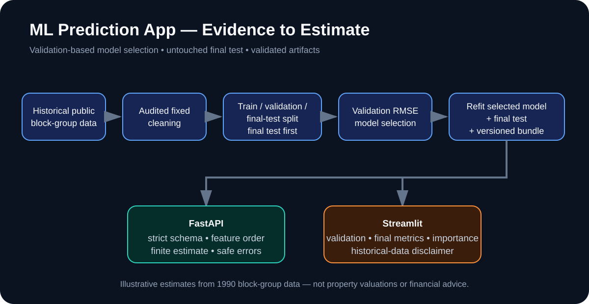

# ML Prediction App — California Housing

A reproducible regression application that moves beyond a notebook: transparent cleaning, validation-based model selection, an untouched final test evaluation, validated model artifacts, FastAPI, Streamlit, Docker and explicit model limitations.



## Deployment status

Historical deployment URLs, last manually verified on **1 August 2026**:

- **Streamlit UI:** https://meet-tala-ml-prediction-app-px2pch6zms5lrdhxyxurht.streamlit.app
- **FastAPI service:** https://ml-prediction-app-xfsd.onrender.com
- **Interactive API documentation:** https://ml-prediction-app-xfsd.onrender.com/docs
- **Health check:** https://ml-prediction-app-xfsd.onrender.com/health

JR05 repository verification does not treat an automation fetch failure as proof that either host is down. The URLs above are historical deployment candidates until the current JR05 revision is freshly smoke-tested after deployment.

> The output is an illustrative **historical median block-group value estimate** derived from 1990 US Census data. It is **not** an individual property valuation, appraisal, current California housing value, investment recommendation or financial advice.

## Why this project exists

Many machine-learning portfolio projects stop at model training. This project demonstrates the engineering and evaluation discipline around a model:

- a visible Linear Regression baseline and Random Forest candidate;
- deterministic train/validation/final-test separation;
- model selection on validation RMSE, not on the final test set;
- one final held-out evaluation after selection;
- auditable cleaning row counts;
- exact validated training-environment metadata;
- a canonical feature schema shared by training and serving;
- a versioned model bundle with exact scikit-learn compatibility enforcement;
- strict API and UI input handling;
- Python 3.10–3.12 tests, dependency checks and security auditing;
- non-root Docker serving and API smoke tests;
- transparent model-risk documentation.

## Engineering highlights

- Public California Housing dataset from scikit-learn, derived from 1990 US Census block-group aggregates.
- Cleaning audit records raw rows, exact duplicates, `AveRooms` removals, `AveOccup` removals and final rows.
- Final test partition is created first with `random_state=42`; validation is then split from the development data with `random_state=43`.
- Linear Regression baseline uses training-fitted standardisation.
- Random Forest uses fixed parameters: 200 trees, maximum depth 14 and random state 42.
- The fixed candidates are compared using **validation RMSE**; an exact tie would select the simpler Linear Regression baseline.
- The selected model is refit on train + validation and evaluated once on the untouched final test set.
- `exports/metrics.json` is the authoritative generated evidence and records the exact validated environment.
- Canonical feature order is shared by training, FastAPI and Streamlit.
- API demo bounds and Streamlit convenience bounds are explicitly distinguished from cleaned training-data ranges.
- Extra, missing, non-finite and out-of-range API inputs are rejected.
- Missing, corrupt and incompatible artifacts return safe errors without exposing local paths or raw deserialization details.
- Joblib artifacts are trusted-code files only; the API accepts no uploaded model or user-controlled artifact path.

## Final JR05 evaluation evidence

Validated training environment:

- Python **3.12.14**
- pandas **2.3.3**
- NumPy **2.5.2**
- scikit-learn **1.9.0**
- joblib **1.6.0**

Cleaning and split:

- raw rows: **20,640**
- exact duplicates removed: **0**
- `AveRooms >= 30` removed: **24**
- `AveOccup >= 15` removed after prior filtering: **19**
- cleaned rows: **20,597**
- train: **12,357**
- validation: **4,120**
- final test: **4,120**

Validation metrics used for model selection:

| Model | RMSE | MAE | R² |
|---|---:|---:|---:|
| Linear Regression baseline | 0.6877 | 0.5023 | 0.6454 |
| Random Forest | **0.5356** | **0.3529** | **0.7850** |

**Selected model: Random Forest**, because it had the lower validation RMSE.

Final held-out test metrics for the selected model after refitting on train + validation:

| Model | RMSE | MAE | R² |
|---|---:|---:|---:|
| Random Forest | **0.4771** | **0.3202** | **0.8290** |

R² here is the proportion of target variance explained on this specific held-out historical dataset split. It is **not** 82.9% prediction accuracy, confidence or the percentage of homes predicted correctly. One deterministic test split does not prove temporal or population-wide generalisation.

The pipeline was rerun in the same validated environment and produced the same split counts, selected model, metrics and generated metrics file byte-for-byte. CI also compares the committed `exports/metrics.json` with a fresh real pipeline run.

## Architecture

```text
California Housing dataset
        |
        v
Audited fixed cleaning
        |
        v
Final test split created first
        |
        +-----------------------------> untouched final test
        |
        v
development train / validation split
        |
   +----+----+
   |         |
Linear    Random Forest
baseline       candidate
   |         |
   +----v----+
 validation RMSE selection
        |
        v
refit selected model on train + validation
        |
        v
one final held-out test evaluation
        |
        v
versioned selected-model bundle
        |
   +----+----+
   |         |
FastAPI    Streamlit
```

See [`docs/architecture.md`](docs/architecture.md) and [`docs/model-card.md`](docs/model-card.md).

## Quick start

Requirements: Python 3.10–3.12 and internet access for the first California Housing dataset download.

```bash
git clone https://github.com/Meettala/ml-prediction-app.git
cd ml-prediction-app
python -m venv .venv
source .venv/bin/activate
python -m pip install -r requirements.txt
python -m src.mlapp.pipeline
```

Windows PowerShell activation:

```powershell
.venv\Scripts\Activate.ps1
```

The training command writes trusted local outputs to:

```text
models/selected_model.joblib
exports/metrics.json
```

`joblib`/pickle files can execute code while loading. Only load artifacts created by this trusted local pipeline; never accept uploaded model files or user-controlled artifact paths. The loader requires the artifact's recorded scikit-learn version to match the runtime version exactly; otherwise retrain in the current environment.

## Run the interfaces locally

FastAPI:

```bash
uvicorn api.main:app --reload
```

Open `http://localhost:8000/docs`.

Streamlit:

```bash
streamlit run streamlit_app/app.py
```

Open `http://localhost:8501`.

## Example API request

```bash
curl -X POST http://localhost:8000/predict \
  -H "Content-Type: application/json" \
  -d '{
    "MedInc": 5.0,
    "HouseAge": 20,
    "AveRooms": 6.0,
    "AveBedrms": 1.0,
    "Population": 1500,
    "AveOccup": 3.0,
    "Latitude": 34.0,
    "Longitude": -118.0
  }'
```

The response identifies the selected model and includes the historical-data/non-valuation disclaimer. Missing fields, extra fields, non-finite values and out-of-range values are rejected by Pydantic validation.

## Verification

```bash
python -m pip install -r requirements-dev.txt
python -m pip check
python -m pytest
ruff check src api streamlit_app tests tools
pip-audit -r requirements.txt
python -m src.mlapp.pipeline
python -m tools.verify_reproducibility
```

The real-data training evidence runs in CI on Python 3.12; unit/integration tests run across Python 3.10–3.12. The real pipeline is intentionally not duplicated in every matrix job.

## Docker API demo

```bash
docker build --no-cache -t ml-prediction-app .
docker run --rm -p 8000:8000 ml-prediction-app
```

CI builds the image from scratch, trains the model in the builder stage, verifies the non-root `appuser`, checks `/health` and `/openapi.json`, sends one valid `/predict` request, confirms one invalid request is rejected, and removes the container.

## Feature and input-boundary truth

The eight features are:

`MedInc`, `HouseAge`, `AveRooms`, `AveBedrms`, `Population`, `AveOccup`, `Latitude`, `Longitude`.

`exports/metrics.json` records, per feature:

- description and unit;
- observed range after cleaning;
- API safety/demo range;
- Streamlit convenience range.

The cleaning thresholds for `AveRooms` and `AveOccup` are transparent fixed demonstration filters for extreme aggregate values. They are not claimed to be statistically optimal outlier treatment. UI/API bounds are serving controls, not a claim that they are the training schema.

## Model limitations

- The data reflects 1990 conditions, not current prices.
- Records are block-group aggregates, not individual properties.
- Historical geographic and socioeconomic patterns can encode structural inequities.
- One held-out split does not prove performance across time, regions or populations.
- No fairness or temporal-generalisation study is claimed.
- Random Forest impurity feature importance is model inspection, not causal explanation, and can favour some feature structures.
- Inputs within accepted ranges can still produce inaccurate estimates.
- The public demo architecture has no authentication, rate limiting, drift monitoring or governed model registry.

See [`docs/model-card.md`](docs/model-card.md) for the full model-risk statement.

## Repository structure

```text
.
├── src/mlapp/               # data, training, artifacts and pipeline
├── api/                     # FastAPI service
├── streamlit_app/           # interactive portfolio UI
├── tests/                   # unit, integration and boundary tests
├── tools/                   # reproducibility verification
├── exports/metrics.json     # generated authoritative evaluation evidence
├── docs/                    # architecture, model card, roadmap and portfolio guide
├── .github/workflows/       # CI
├── Dockerfile
├── AI_HANDOFF.md
├── CHANGELOG.md
├── CONTRIBUTING.md
├── SECURITY.md
└── LICENSE
```

## Portfolio materials

- [`docs/PORTFOLIO_PRESENTATION_GUIDE.md`](docs/PORTFOLIO_PRESENTATION_GUIDE.md)
- [`docs/assets/architecture.svg`](docs/assets/architecture.svg)
- [`docs/assets/social-preview.svg`](docs/assets/social-preview.svg)
- [`AI_HANDOFF.md`](AI_HANDOFF.md)

## Commercial boundary

This public repository is MIT licensed for portfolio and reference use. A paid or client-facing service should use current licensed data and separate governance for identity, rate limiting, signed artifacts, monitoring, drift evaluation, privacy/retention, legal review and independent security/model-risk testing.

## Licence

MIT. See [`LICENSE`](LICENSE).

## Author

Built by [Meet Tala](https://github.com/Meettala) to demonstrate applied machine learning, honest evaluation, FastAPI, Streamlit, artifact validation, Docker and production-minded documentation.
